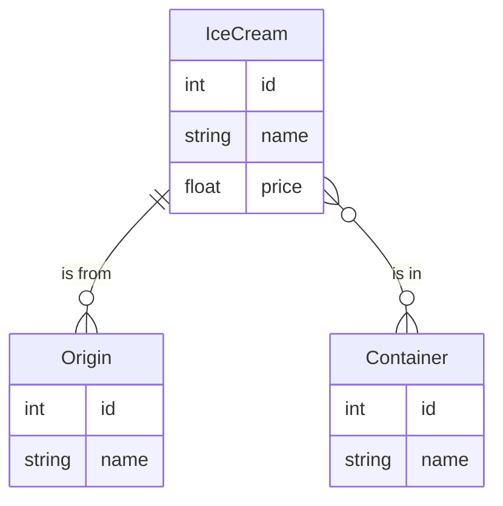

# icecream-exemple
Mise en oeuvre d'une api avec Springboot et d'un client de test BDD avec Cucumber 
Avec OpenApi generator, génération à partir d'un fichier OpenAPI "icecream.yaml" :
 - des intertaces et des DTO pour Springboot
 - d'un client et des DTO pour le client BDD

 ## Auteurs
  - Lazar Pavicevic
  - Jonathan Friedli

 ## Video
  [Cliquez ici pour voir la vidéo](https://www.swisstransfer.com/d/eb376185-c33d-4b1c-be5a-ce22d0e69020)

 ## Logique métier
 Nous avons décidé de choisir les glaces comme métier pour cet exemple. Nous nous sommes inspirés de la vidéo de IBM sur les [API REST](https://www.youtube.com/watch?v=lsMQRaeKNDk).

Voici notre diagramme de relations d'entités :

 
 ## Installation et utilisation avec IntelliJ
  - git clone de ce repository et import sous IntelliJ du projet (maven) qui contient 2 modules : icecream-api pour Springboot
 et icecream-spec pour le client BDD
  - Affectation d'un Java JDK 17 (File / Project structure / Project /SDK
 ### icecream-api
  - Gérération du dossier target avec "maven clean package" (fenêtre Maven, icecream-exemple/icecream-api/Lifecycle)
  - Déclaration "Generated Source Root" du dossier target/generated-sources/openapi/src/main/java 
    via le menu contextuel et "Mark directory as" sur ce dossier
  - Lancement du main Springboot (Swagger2SpringBoot)
  - L'interface utilisateur swagger-ui est accessible à http://localhost:9090/api
  - La base de donnée H2 est accessible à http://localhost:9090/api/h2-console
      url: jdbc:h2:mem:testdb username:sa pas de password
  ### icecream-spec
  - Gérération du dossier target avec "maven clean package" (fenêtre Maven, icecream-exemple/icecream-spec/Lifecycle)
    si Springboot tourne, les tests BDD doivent s'exécuter sans erreurs au cours de l'exécution de Maven
  - Déclaration "Generated Source Root" du dossier target/generated-sources/openapi/src/main/java 
  - La Feature Cucumber du dossier src/test/resources/features/icecream.feature doit être exécutable sous IntelliJ
  
  ## Cycle de développement
  - Modifier le fichier OpenAPI "icecream.yaml" sous src/main/resource des 2 projets (copies identiques)
  - Api Springboot
    - Relancer "maven clean package" de icecream-api
    - Développer ou adapter les controlleurs, les DTO et les classes liées dans l'api Springboot
    - Si vous avez ajouté ou modifié des entités, vous pouvez initialiser des données 
      dans le fichier data.sql de src/main/resource
    - Relancer Sprigboot et faire quelques tests manuels avec swagger-ui
  - Tests BDD cucumber (en mode TDD, les 2 premières étapes peuvent être effectuées avant le développement de l'api)
    - Relancer "maven clean package" de icecream-spec, les tests seront peut-être en erreur et peuvent être skippés
    - Développer ou adapter les features Cucumber et les steps pour les nouvelles fonctionalités
    - Exécuter les tests sous IntelliJ et relancer "maven clean package" de icecream-spec pour exécuter les tests avec Maven
  
    
